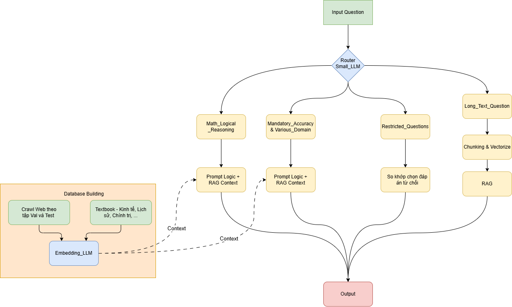

# RAG-based LLM-MCQ — VNPT AI Track 2: The Builder

Giải pháp trả lời **trắc nghiệm (MCQ)** dựa trên **RAG (Retrieval-Augmented Generation)** cho cuộc thi **VNPT AI - Track 2: The Builder**.  
Hệ thống gồm 2 phần chính:
1) **Build corpus / Vector DB** (crawl + chunk + embed + FAISS)  
2) **Inference pipeline** (router → retrieval → reasoning/generation → xuất `submission.csv`)

---

## 1. Repository structure

```text
.
├── notebooks/                 # Build corpus: crawl, clean, chunk, embed
│   ├── corpus/                # Corpus theo nhóm ngành (ví dụ)
│   │   ├── econ/              # Kinh tế
│   │   ├── khtn/              # Khoa học tự nhiên
│   │   └── khxh/              # Khoa học xã hội
├── query/                     # (tuỳ chọn) lưu query logs / debug samples
├── database/                  # FAISS index + metadata (sau khi build)
└── src/                       # Inference pipeline + router
    ├── config/                # cấu hình (model, embedding, paths, top_k, ...)
    ├── core/                  # pipeline core: retrieval, rerank (nếu có), generation
    ├── crawl/                 # crawler/util cho web/textbook (nếu dùng runtime)
    ├── prompt_template/       # prompt theo nhóm câu hỏi
    ├── query/                 # query builder / normalizer
    ├── template/              # template xử lý I/O (private_test.json, submission.csv)
    └── utils/                 # helpers: logging, cache, text utils, ...
```

---

## 2. Pipeline Flow (End-to-End)



### 2.1. Offline: Build corpus → Vector Database

**Nguồn dữ liệu**
- **Web**: dùng DuckDuckGoSearch crawl đáp án/định nghĩa liên quan đến từng câu hỏi, lấy top-K kết quả.
- **Textbook/notes**: crawl kiến thức từ giáo trình môn đại cương (Giải tích, XSTK, Kinh tế vĩ mô, …), tổ chức lại thành markdown notes gọn.

**Xử lý & Index**
- Cleaning cơ bản: normalize unicode, bỏ HTML rác, de-dup theo URL/nội dung (khuyến nghị).
- Chunking:
  - Giới hạn **~500 từ/chunk**
  - Với textbook markdown: chunk theo **header/tags** và vẫn giới hạn max 500 từ.
- Embedding:
  - Embed bằng **model do chương trình/đội thi cấu hình**
  - Lưu **FAISS index** + metadata vào `database/`.

---

### 2.2. Online: Query Inference Pipeline

#### Router Module
- **Restricted Questions**: câu hỏi nhạy cảm/không phù hợp → chọn phương án từ chối (nếu có).
- **Long_Text_Questions**: RAG trên đoạn văn được cung cấp (chunk đoạn văn → retrieve nội bộ → trả lời).
- **Math_Logical_Reasoning**: ưu tiên suy luận + có thể RAG công thức/định lý.
- **Mandatory_Accuracy_Questions**: cần độ chính xác cao → tăng cường retrieval web/corpus.
- **Various_Domain**: domain tổng hợp → RAG.

## 3. Data Processing

### 3.1 Crawl corpus (Web)
- Input: dataset câu hỏi (MCQ)
- Với mỗi câu hỏi:
  - Sinh query tìm kiếm (có thể gồm: nội dung câu hỏi + keyword trọng tâm + các lựa chọn A/B/C/D)
  - Crawl top-K results
  - Parse nội dung (title, snippet, main text)
  - Lưu raw + cleaned text kèm metadata (source, url, time)

### 3.2 Crawl textbook/notes
- Thu thập từ giáo trình/tài liệu học phần → chuyển về markdown
- Chuẩn hoá header (H1/H2/H3/H4) để chunk ổn định

### 3.3 Chunking
- Web chunks: sliding window hoặc rule-based, giới hạn ~500 từ
- Markdown chunks: tách theo header → gộp/đẩy bớt để không vượt 500 từ/chunk

### 3.4 Embedding & Indexing
- Embed từng chunk → vector
- Lưu:
  - `database/faiss.index`
  - `database/meta.jsonl` (id, source, url, title, chunk_text, tags, ...)

---

## 4. Docker

Nếu dùng GPU: **bắt buộc CUDA 12.2** (khuyến nghị base image `nvidia/cuda:12.2.0-devel-ubuntu20.04`)  

---

## 5. Hướng dẫn chạy

### 5.1 Chạy Python
```bash
python -m venv .venv
source .venv/bin/activate
pip install -r requirements.txt
python src/config/config.py


# chạy inference local
python predict.py
```

### 5.2 Chạy Docker
```bash
# build
sudo docker build -t team_submission .

# run
sudo docker run --gpus all team_submission
```